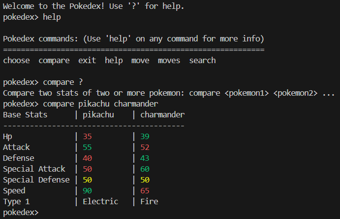

# Pokedex CLI

## Overview

Pokedex CLI is an interactive command-line tool that acts as a Pokedex by interacting with the PokeAPI. It features tab-to-autocomplete, stat comparisons, move lookups, and additional functionalities. Note: This project is still under development.

## Features

- **Tab-to-Autocomplete:** Easily complete commands and Pokemon names.
- **Stat Comparisons:** Compare stats of multiple Pokemon.
- **Move Lookups:** Retrieve details for specific moves and move sets.
- **Contextual Commands:** Enter context mode for specific Pokemon.

## Global Commands

### General Commands

- `search <pokemon>`: Validate a Pokemon's name. Useful for finding the API's exact naming convention.
- `moves <pokemon>`: List all moves available to a specified Pokemon.
- `move <move name>`: Retrieve detailed information about a specific move.
- `choose <pokemon>`: Enter a context mode tailored to the given Pokemon.

### Pokemon Commands

#### General Commands

- `stats`: Display the Pokemon's base stats.
- `version <game-version>`: Specify a game version for contextual information about the Pokemon.

#### Version-Specific Commands

- `move <move-name>`: Retrieve detailed information about a specific move.
- `moves`: List details about the Pokemon's moves, or get more specific:
    - `moves level`: Moves learned by leveling up.
    - `moves machine`: Moves learned from Technical Machines (TMs) or Hidden Machines (HMs).
    - `moves tutor`: Moves taught by a move tutor.
    - `moves egg`: Moves learned through breeding.
